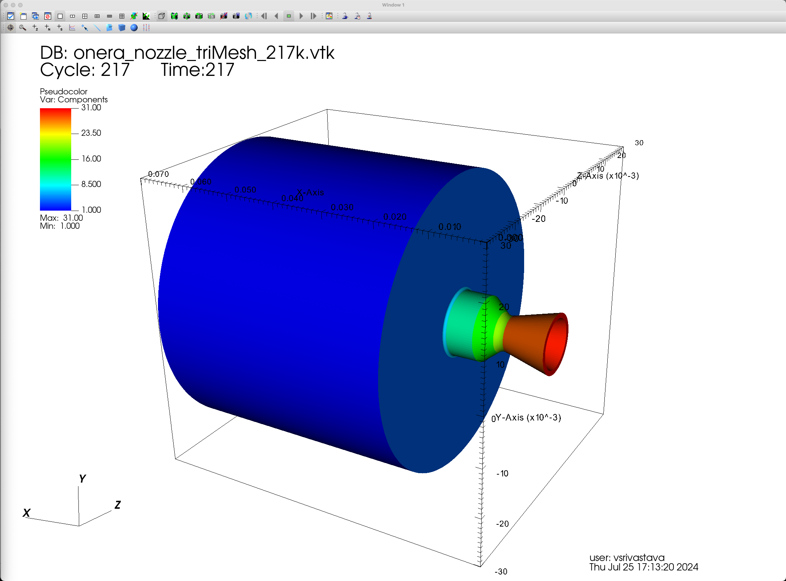
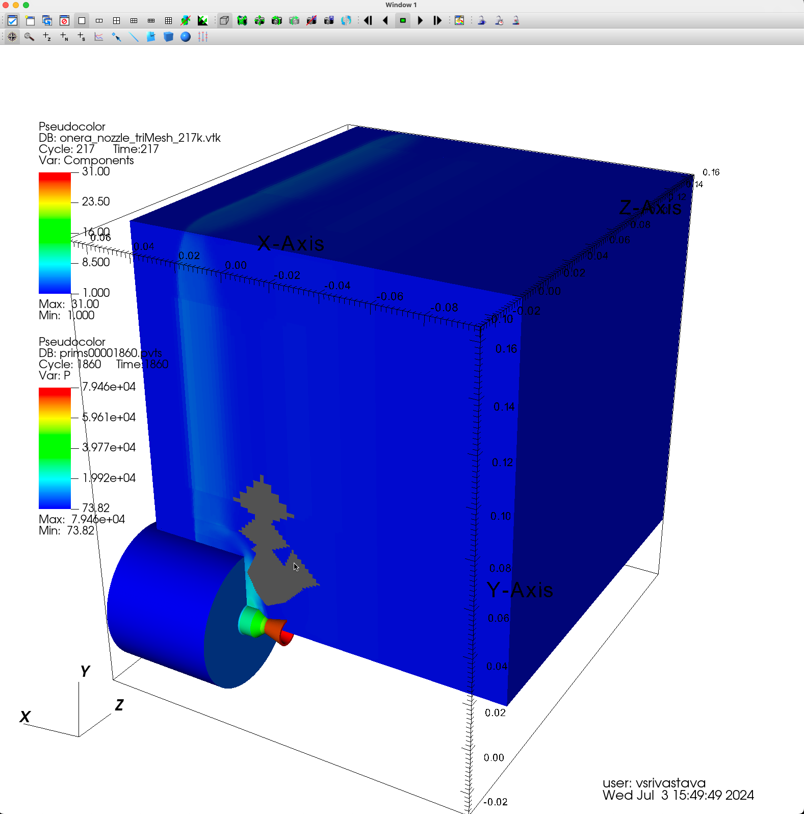
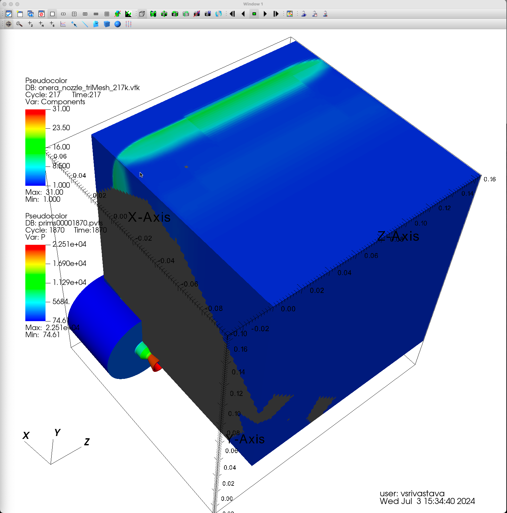
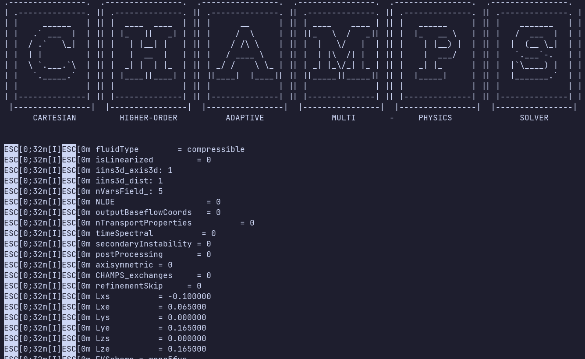

# AEROS Summary Presentation

Department of Aerospace Engineering
University of Maryland

Vai Srivastava

<!--
Speaker Notes: SMILE!
-->
---
## Outline

- Project Motivation
- Summer Objectives
  * Gain Familiarity with CFD Codebase
  * Onera Retro Propulsion Nozzle Test Case
  * Code Environment Documentation
- Summer Outcomes
- References

<!--
Speaker Notes: Here we're listing what we'll be covering in this presentation, I'm sure you all are quite familiar with the structure of these presentations by now (chuckle).
-->
---
## Project Motivation

- Pitch for ENAE Honors Thesis: Generalized Modeling of Ionized Flow in Magnetic Nozzles
- Dr. Brehm and I are coordinating on this project
- Will be utilizing the CHAMPS CFD framework

<!--
Speaker Notes: I had this idea for my Aerospace Honors Thesis. I have been interested in ionized flows for a while, and Dr. Brehm has offered his assistance in getting me familiarized with the CHAMPS (Cartesian Higher-Order Adaptive Multi-Physics Solver) framework for CFD which he has been working with for quite some time.
-->
---
## Summer Objectives

* Gain Familiarity with CFD Codebase
* Onera Retro Propulsion Nozzle Case
* Code Environment Documentation

<!--
Speaker Notes: This brings us to my summer objectives for AEROS, which are as follows: 1. I would like to gain familiarity with the CHAMPS CFD Codebase. This familiarity will be key in my summer work with Dr. Brehm and in my future work on my thesis, as I will be tackling physics that both Dr. Brehm and I are unfamiliar with (regarding the Ionized Flow). 2. Dr. Brehm has provided me with a case to work on, a retro-propulsion nozzle in development by Purdue and Case Western University in conjunction with a French research facility called ONERA. As well, as I encountered a lot of technical difficulties with getting my coding environment set up, I took it on myself to write detailed notes in hopes of developing documentation for future researchers.
-->
---
<!-- _header: AEROS: Summer Objectives -->
### Gain Familiarity with CFD Codebase

- Reading research papers
- Studying Anderson's Compressible Flow Textbook
- Discussions with Dr. Brehm

<!--
Speaker Notes:
-->
---
<!-- _header: AEROS: Summer Objectives -->
### ONERA Retro Propulsion Nozzle Case

- Retro Propulsion nozzle
- Fairly simple geometry
- ONERA was encountering odd shock formations when running experiments on the nozzle

<!--
Speaker Notes: N/A
-->
---
<!-- _header: AEROS: Summer Objectives -->
### Test Case - GPU Efforts

- Took a short time to get GPU code set up
- Iterated on GPU code and simulation conditions many times, as encountered odd issues
- Joel McQuaid and I worked together on trying to fix this, but could not find a solution
<!--
Speaker Notes: Joel McQuaid, very knowledgeable student, recent PHD graduate from UMD, and has worked with Dr. Brehm for many years
-->
---
<!-- _header: AEROS: Summer Objectives -->
### Test Case - GPU Efforts

<!--
Speaker Notes: As you can see, we are getting a shock formation at the corner here (point). At first, this seemed to be due to the granularity of the simulation (maybe it was not fine enough to account for the conditions at the corner, and the math would break down). Upon re-running the simulation with a different setup, this was not the issue (forward 1 slide, back to this slide). I made minor attempts at modifying the code, but I was out of my depth. Joel and I tried working together on it, but decided that using the CPU codebase, which has been stable for many years would probably be a faster solution to our problem.
-->
---
<!-- _header: AEROS: Summer Objectives -->
### Test Case - GPU Efforts

<!--
Speaker Notes: N/A
-->
---
<!-- _header: AEROS: Summer Objectives -->
### Test Case - CPU Efforts

- Decided to move test case to CPU
- Took much longer to get set up
- Was only able to get the simulation to run once before program end
- Will continue working in coming weeks to render results (and iterate on cpu code if necessary)
<!--
Speaker Notes: Length of time to get CPU code set up (as well as extremely outdated documentation, ~2018 was the last update to the /docs directory of the codebase) is what inspired me to write up my own set of documentation.
-->
---
<!-- _header: AEROS: Summer Objectives -->
### Test Case - CPU Efforts

<!--
Speaker Notes: As I mentioned earlier, I did not have time to render (or even validate) the results of this simulation, though it has fully completed without failure (as opposed to the GPU code, which would display a CFL number of in between 0.05 and NAN for about 95% of the time steps in the simulation which [obviously] means something went wrong in the simulation.

CFL = Courant-Friedrichs-Lewy condition. Effectively the maximal size of time step for our PDEs to converge. Because the code is adaptive (A in CHAMPS), the CFL is variable, and the software attempts to choose the highest possible CFL for each time step in order to save on computation. Having such low (or non-existent) CFL conditions indicates that there is something wrong, and our PDE is moving extremely quickly, likely due to divergence.
-->
---
<!-- _header: AEROS: Summer Objectives -->
### Code Environment Documentation

- Unfortunately not much to display here, my notes are all in physical notebooks
- I was preoccupied with the ONERA Test Case, and did not have time to digitize my notes
- I plan on digitizing and making them available before the semester starts, in order to aid anyone else who struggles like I did with getting CHAMPS set up.

<!--
Speaker Notes: N/A
-->
---
## Summer Outcomes

* ✅ Gain Familiarity with CFD Codebase
* ❌ Onera Retro Propulsion Nozzle Case
* ❌ Code Environment Documentation

<!--
Speaker Notes: In summary, there was a lot I tackled, but I was not able to finish my projects within the timeframe provided by AEROS. I plan to continue working over the coming weeks to complete 
-->
---
# Any Questions?

<!--
Speaker Notes: N/A
-->
